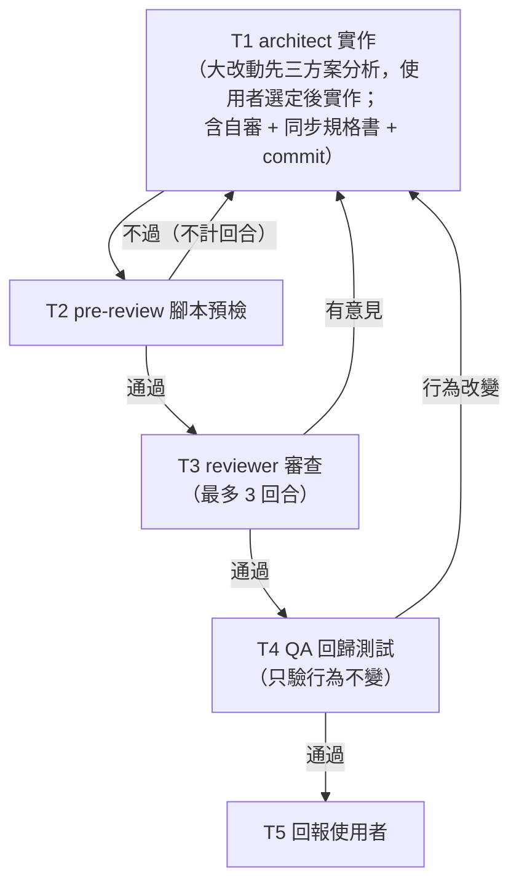
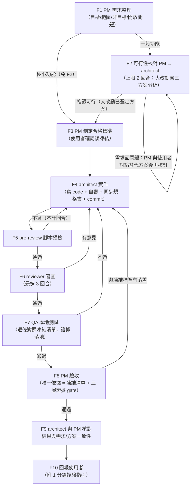

# Claude Dev-Flow Kit

一份可攜的 Claude Code 設定組合（「kit」在這裡就是「一份能整包複製到任何電腦、直接安裝使用的設定/工具組合」的意思，不是 Claude Code 的專有功能），內含兩套機制：

1. **CTO 分派式標準開發流程**——主 Claude 扮演 orchestrator（CTO），依任務是「技術型」（重構/效能/架構調整，不影響功能）或「功能型」（新增/修改功能、bug fix）分流成兩條軌道，分派給 architect / reviewer / QA / PM 四個 subagent，各 gate 的通過條件、回合數上限都由骨架確定性控制。（完整流程見下方〈[標準開發流程詳解](#標準開發流程詳解)〉）
2. **自我學習迴圈**——任務中擷取的教訓（技術陷阱、協作偏好、流程方法論）累積在收件匣，定期蒸餾成精煉記憶，重複出現的教訓升級成正式規則或 skill；另外還有一套獨立的「Prompt 教練」，用來檢討使用者自己的 prompt 撰寫習慣。

## 目錄導覽

```
claude-dev-flow/
├── CLAUDE.md              主設定檔精簡版：編排協定、標準開發流程（技術軌/功能軌）、工程紀律等
├── install.sh             安裝腳本（Git Bash / macOS / Linux）
├── install.ps1            安裝腳本（原生 PowerShell）
├── agents/                四個 subagent 定義：architect（架構師）/ pm（產品經理）/ qa（測試）/ reviewer（審查）
├── acceptance/README.md   驗收清單機制說明（三段式格式、證據落地規約）
├── scripts/                pre-review.sh（實作後確定性預檢）、verify-evidence.sh（驗收證據完整性檢查）
├── state/README.md        任務檢查點格式說明（斷線後手動接續用，不含自動監控）
├── products/INDEX.md      多產品配置索引機制（空模板，需自行登錄）
├── rules/                 learning.md（自我學習迴圈定義）、prompt-coaching.md（Prompt 教練定義）
├── skills/                learn / evolve / promptcoach 三個 skill 定義
├── memory/                MEMORY.md / inbox.md（空白模板，會隨使用累積你自己的教訓）
└── DECISION_LOG.md        跨產品決策紀錄模板（空白）
```

## 標準開發流程詳解

> 本節是流程的**導讀**，方便在 GitHub 上直接理解整套機制；規則本體以 [`CLAUDE.md`](CLAUDE.md) 的「標準開發流程」章與 [`agents/`](agents/) 各角色定義為準，兩者不一致時以 CLAUDE.md 為準。

### 角色分工

| 角色 | 定位 | 能做 | 不能做 |
|------|------|------|--------|
| **主 Claude（CTO / orchestrator）** | 分派、決策、把關 | 任務分類、交棒各 agent、gate pass/fail 判定、親自抽驗驗收證據 | 自己動手寫 code |
| **architect** | 資深工程師兼架構師 | 可行性評估（唯讀）、三方案分析、實作、自審、同步規格書、commit | 自行展開 workflow、跳過審查 |
| **reviewer** | 程式碼審查員 | commit 前完整審查（安全/效能/邊界/資料一致性），回報通過或問題清單 | 修改程式碼、自訂重試回合數 |
| **qa** | 測試員 | 本地測試／回歸測試，證據落地為檔案 | 下放行決策、修改程式碼 |
| **pm** | 產品經理 | 需求整理、可行性核對窗口（**僅需求面**）、制定合格標準、最終驗收 | 修改程式碼、參與技術決策、中途修改凍結標準 |

### 步驟 0：任務分類（主 Claude / CTO）

收到「修改 code」任務時，CTO 先分類並向使用者宣告（一句話即可，使用者可當場否決改判）：

- **技術型**：語法修正、效能優化、重構、架構調整——**不改變任何使用者可見行為與功能邏輯** → 走技術軌（無 PM）
- **功能型**：新增/修改功能、bug fix（修復即行為變更）、任何影響使用者可見行為的改動 → 走功能軌（PM 前置）
- 判斷模糊 → 一律當功能型（寧可多 PM，不可漏驗收）
- 功能型再判是否為「極小」（定義見下方規模表）；是 → 宣告「功能型・極小」走極簡化路徑

PM 的職權邊界貫穿全流程：**需求面**問題（需求無法達成、需求要調整、有替代的功能做法）才走 PM 與使用者討論；**技術面**風險（效能、資安、需大幅修改、資料一致性等程式面問題）不經 PM，由 architect 直接回報 CTO，再由 CTO 呈報使用者裁決。

### 任務規模定義（單一權威表）

規模四級：**極小（僅功能軌）／小／中／大**。「極小」由 CTO 在步驟 0 宣告；小/中/大由 architect 第一次被 invoke 時 triage 並宣告。判斷不出來一律升一級。

| 規模 | 判定條件（客觀、可驗證） | 技術軌走法 | 功能軌走法 |
|------|------------------------|-----------|-----------|
| **極小** | 功能軌限定，四條件**全部**符合：(1) 只調整既有的單一使用者可見行為（改文案/label/顯示格式/預設排序/既有欄位顯示切換），不新增頁面、流程、功能 (2) 不動 API contract、DB schema、權限、金流、資料寫入邏輯 (3) 改動落在顯示層，預估 ≤ 2 檔 (4) 預期結果能寫成恰好 1 條三段式驗收標準 | —（技術軌無極小級，併入「小」） | F1 極簡化（PM 出 1 條迷你標準）→ 免 F2 → F3 凍結 → F4 起照走 |
| **小** | 單檔或單函式；改字串/CSS/typo、補空值檢查、加 log、修 lint 等級 | T1 直接實作 | F1 完整需求整理；F2 快速核對（architect 簡答可行即過，不出三方案） |
| **中** | 同模組內多檔；純前端或純後端單側；不動 API contract、不動 DB schema | T1 直接實作（實作前先用 1-2 句講思路） | F1＋F2 一般核對（評估可行性與風險，不出三方案） |
| **大** | 命中任一：跨模組（前後端都改）、新 feature、改 API contract、改 DB schema、引入新依賴、改架構分層、效能改造、動到 auth/權限/租戶隔離、動到 cache/Redis 結構、動到共用模組 | T1 內先走三方案分析，使用者選定後實作 | F2 內產出三方案分析＋技術風險，使用者選定方案後進 F3 |

### 技術軌 T1–T5（無 PM、無凍結清單）



- **T1 architect 實作**：規模 triage 照舊——大型架構調整先三方案分析、使用者選定後實作；含自審、同步規格書、commit。
- **T2 pre-review 腳本預檢**：確定性腳本（`scripts/pre-review.sh`）擋規則性問題；不過退回 T1 修正重跑，**不計入** reviewer 的 3 回合上限。
- **T3 reviewer 審查**：architect ↔ reviewer 最多 3 回合，超過回報使用者。
- **T4 QA 回歸測試**：只驗證「受改動影響的相關功能維持原有邏輯」，不驗新行為（技術型不該有新行為）。無凍結清單，證據依臨時任務規約存 `/tmp`。發現任何使用者可見行為改變 → 退回 architect 重跑 T2→T3→T4，並評估改判功能型。
- **T5 回報使用者**：改了什麼、為什麼行為不變、回歸證據。

### 功能軌 F1–F10（PM 前置 + 標準凍結）



- **F1 PM 需求整理**：一般功能整理成結構化需求（目標/範圍/非目標/開放問題），與使用者確認理解無誤。極小功能（規模表四條件全符合）走極簡化：PM 直接濃縮成 1 條三段式迷你驗收標準，使用者確認後直接跳 F3 凍結、免 F2。
- **F2 可行性核對**（PM ↔ architect，上限 2 回合，超過回報使用者裁決）：architect **唯讀**評估可行性，此階段不動 code；大改動一併產出三方案分析（架構圖/優缺點/風險/回滾難度/測試策略 + 比較表 + 推薦）。問題分流兩條回報路徑：
  - **需求面**（需求無法達成、需求本身要調整、有替代的功能做法）→ architect 提給 PM → PM 與使用者討論替代方案 → 修訂需求 → 再核對
  - **技術面**（效能、資安、需大幅修改、資料一致性等程式面風險）→ 不經 PM，architect 直接回報 CTO，由 CTO 呈報使用者裁決；大改動時寫進三方案的「潛在風險」段，隨方案選擇一併決策
- **F3 PM 制定合格標準（凍結）**：依「使用者確認後的需求 +（大改動）選定方案」產出三段式驗收清單（格式見 `acceptance/README.md`）。經使用者確認後凍結，開發期間任何角色（含 PM 自己）不得修改；需求中途變更 → 回到 F1 重走，舊清單標記 superseded。
- **F4–F7**：architect 實作（同一隻 agent：寫 code + 自審 + 同步規格書 + commit）→ pre-review 預檢 → reviewer 審查（3 回合上限）→ QA 本地測試（逐條對照 F3 凍結清單，證據落地 `evidence/`）。任一關卡不過都退回 F4，後續關卡全套重跑。
- **F8 PM 驗收**：唯一依據 = F3 凍結清單，配三層證據 gate——(1) 證據落地：每驗一條 A&lt;n&gt; 至少落地一個證據檔，CTO 放行前跑 `verify-evidence.sh` 確定性檢查；(2) 抽驗：腳本通過後 CTO 親自讀 1-2 張關鍵截圖，畫面對不上宣稱 → 整份驗收報告降級不可信、全部重驗；(3) 反方 PM（大改動才加開）：獨立 agent 以「證明功能沒完成」為目標專挑反例。與凍結標準有落差或反方抓到反例 → 退回 F4 重跑 F5→F6→F7→F8；證據缺件/抽驗不符 → 退回補驗，不算失敗。
- **F9–F10**：architect 與 PM 核對最終結果與 F1 需求／選定方案的一致性（不一致不強制打回，落差寫入回報交使用者決定）→ 回報使用者，附「1 分鐘複驗指引」（確切 URL + 帳號 + 3 步以內操作 + 應看到什麼）。

### 流程守則摘要

| 守則 | 內容 |
|------|------|
| 回合上限 | PM ↔ architect 可行性核對 2 回合；architect ↔ reviewer 審查 3 回合；pre-review 腳本重跑不計回合。超限一律回報使用者，agent 不得自行加碼 |
| 凍結原則 | 合格標準在實作開始前凍結，中途不可變更；驗收有落差退回 architect，不得放寬標準遷就結果；需求變更回 F1 重走 |
| 編排護欄 | 流程骨架、所有 gate、回退條件由設定檔確定性控制；subagent 一律不得自行展開 workflow；平行 agent 唯讀且維度互斥 |
| 流程邊界 | 到「本地驗收通過」為止即停止——不含 push、不含部署驗證、不含線上 QA；commit / merge 時機由使用者自行決定 |

## 安裝方式

在目標機器的 kit 根目錄執行（預設安裝到 `~/.claude`，也可指定其他目標路徑）：

```bash
# Git Bash / macOS / Linux
./install.sh
# 或指定目標
./install.sh /path/to/.claude
```

```powershell
# 原生 PowerShell
.\install.ps1
# 或指定目標
.\install.ps1 -Dest C:\path\to\.claude
```

### 衝突時如何處理（全自動，不會跳出選項問你）

安裝腳本把檔案分三類，各自套用不同的自動化策略——**不覆蓋、不詢問，一律自動處理**：

- **Markdown 文件**（`CLAUDE.md`、`agents/*.md`、`skills/*/SKILL.md`、`acceptance/README.md`、`state/README.md`、`rules/*.md`）：依標題段落自動合併。目標檔裡有相同標題的段落 → 用 kit 最新內容取代該段落；目標檔沒有的標題 → 整段附加到檔尾。你自己在這些檔案裡寫的、kit 沒有的內容完全不會受影響。重跑安裝永遠不會造成同一段落重複出現。
- **可執行腳本**（`scripts/pre-review.sh`、`scripts/verify-evidence.sh`）：逐字比對，相同就跳過；不同的話**不會覆蓋你的原檔**，而是把 kit 版本另存成同目錄的 `pre-review.kit.sh` / `verify-evidence.kit.sh`，兩份都能獨立執行，你可以自行比對後決定要不要採用。之所以不像 markdown 一樣直接合併，是因為腳本是一整條可執行的控制流程，硬把兩段邏輯接在一起，很可能因為前段已經有 `exit` 而讓後半段變成永遠不會執行的死碼，反而是「看起來裝新了、其實沒作用」的假象。
- **資料類檔案**（`memory/MEMORY.md`、`memory/inbox.md`、`memory/prompt-coach/*.md`、`DECISION_LOG.md`、`products/INDEX.md`）：只在完全不存在時才建立，一旦存在就完全不動。這些檔案會隨使用累積你自己的真實資料（學習條目、決策紀錄、產品登錄），任何自動邏輯都不該去動它們。

安裝完成後會印出「下一步」提示：登錄你自己的產品到 `products/INDEX.md`；若有腳本以 `.kit.sh` 並存，記得找時間比對合併。

## 這個 kit 不含什麼（刻意排除）

- **看門狗自動化**：不含任何自動監控/自動復活 session 的機制。斷線後請自行 `claude --resume <session_id>` 手動接續（`state/README.md` 有說明）。
- **排程任務**：不含自動週期回顧的排程設定。若想要定期自動整理自我學習迴圈的記憶，可自行用 `/schedule` 建立一個執行 `evolve` skill 的排程任務。
- **個人化偏好**：不含原始 `~/.claude/CLAUDE.md` 裡的 `model_routing`、誠實性規範、語言規範、Git 分支慣例（特定專案的 worktree 路徑）、前端 RWD 強制引用段等只對特定使用者/專案有意義的設定。
- **任何專案的真實資料**：不含已登錄的產品配置、已累積的學習記憶條目、已寫入的決策紀錄——只有空白模板與機制說明。

## 與原始 `~/.claude` 的關係

本專案是從個人 `~/.claude` 手動導出的**靜態快照**，用於備份/分享/在新機器安裝，兩邊**不會自動同步**。若原始 `~/.claude` 之後有更新，需要人工比對後手動同步進本專案（或反向：本專案更新後，用安裝腳本重跑一次把更新合併回 `~/.claude`）。
